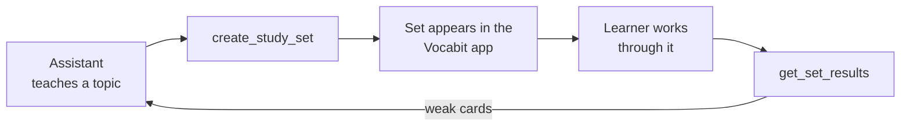

# vocabit-mcp

[](https://github.com/JohnBilousov/vocabit-mcp/actions/workflows/ci.yml)
[](https://www.npmjs.com/package/vocabit-mcp)
[](./LICENSE)

An MCP server for [Vocabit](https://apps.apple.com/app/id6758019550), a flashcard app.
It lets an AI assistant **write a study set into a real app on a real phone, and then read
back how the learner actually did with it**.

Most MCP servers read from an API. This one closes a loop:



The interesting tool is not `create_study_set` — anything can generate flashcards.
It is `get_set_results`: which cards the learner marked *hard*, which they never reached,
how many reviews each one took. The next set is built out of that, not out of a guess.

## Try it in 30 seconds

No backend, no account, no API key:

```bash
npx -y vocabit-mcp --demo
```

Demo mode runs the same server against an in-memory Vocabit with two seeded sets.
Create a set, ask for results, and a deterministic stand-in learner will have worked
through it — flagged in the response as simulated, so it is never mistaken for real data.

To poke at it with a UI:

```bash
npx @modelcontextprotocol/inspector npx -y vocabit-mcp --demo
```

## Install

Listed in the [MCP Registry](https://registry.modelcontextprotocol.io) as `io.github.JohnBilousov/vocabit-mcp`, so clients that read the registry can find it on their own.

<details open>
<summary><b>Claude Code</b></summary>

```bash
claude mcp add vocabit -- npx -y vocabit-mcp
```

</details>

<details>
<summary><b>Claude Desktop / any MCP client</b></summary>

```json
{
  "mcpServers": {
    "vocabit": {
      "command": "npx",
      "args": ["-y", "vocabit-mcp"],
      "env": {
        "VOCABIT_BASE_URL": "https://your-vocabit-backend.example.com",
        "VOCABIT_AGENT_KEY": "your-agent-key"
      }
    }
  }
}
```

Drop the `env` block to run in demo mode.

</details>

## Tools

| Tool | What it does |
|---|---|
| `vocabit_health` | Check the connection and which mode the server is in. |
| `create_study_set` | Publish a set to the learner's app. Returns a deep link that opens it on the device. |
| `list_study_sets` | Recent sets, newest first, each with a progress summary. |
| `get_study_set` | Full contents of one set, plus the topic and notes the assistant attached. |
| `get_set_results` | **The feedback half.** Per-card status, `weakCards`, `untouchedCards`, due cards. |
| `update_study_set` | Retitle, retag, or append cards — typically the follow-up after reading results. |
| `notify_learner` | Telegram ping that a set is waiting. |
| `delete_study_set` | Remove a set from the app. Study history is kept. |

Also exposed: the `vocabit://set/{setId}` **resource** (a set as JSON, listable) and a
`study-session` **prompt** that walks the whole loop.

### Card states

Progress comes from the app's spaced-repetition engine, not from the assistant:

| Status | Meaning |
|---|---|
| `new` | Never reviewed. |
| `struggling` | Learner marked it *hard*. |
| `learning` | Marked *good*. |
| `mastered` | Marked *easy*. |

A set reports `completed: true` once no card is left in `new`.

## Live mode

Point the server at a Vocabit backend that has the agent API enabled:

```bash
export VOCABIT_BASE_URL=https://your-vocabit-backend.example.com
export VOCABIT_AGENT_KEY=...   # must match one of AGENT_API_KEYS on the backend
npx -y vocabit-mcp
```

| Variable | Purpose |
|---|---|
| `VOCABIT_BASE_URL` | Backend base URL. |
| `VOCABIT_AGENT_KEY` | Sent as `X-Agent-Key`. |
| `VOCABIT_USER_ID` | Firebase UID of the learner. Optional; the backend has a default. |
| `VOCABIT_TERM_LANGUAGE` / `VOCABIT_DEFINITION_LANGUAGE` | Defaults for new sets, e.g. `de` / `en`. |
| `VOCABIT_TELEGRAM_ID` | Recipient for `notify_learner`. |
| `VOCABIT_TIMEOUT_MS` | Request timeout, default `20000`. |
| `VOCABIT_DEMO` | `1` forces demo mode. |

Set neither URL nor key and the server starts in demo mode. Set exactly one and it
refuses to start — half a configuration is a mistake, not a hint.

## Design notes

**Demo mode is a first-class client, not a stub.** `HttpVocabitClient` and
`DemoVocabitClient` implement the same `VocabitClient` interface, so no tool has a
branch for "are we pretending?". A reviewer can run the server before they have
credentials, and the test suite exercises the real tool surface over a real MCP
transport rather than mocking the SDK.

**Errors are recoverable, not fatal.** A failed call comes back as `isError` with the
backend's own message plus a hint aimed at the model — `404` says "call
`list_study_sets` to see which sets exist", `401` says "or run with `VOCABIT_DEMO=1`".
Mutually exclusive arguments are rejected with an explanation instead of a guess.

**Output schemas stay loose on the edges.** Identifying fields are required; everything
else is optional, so a backend that grows a field does not turn a working tool into a
validation error.

**Annotations are honest.** `delete_study_set` is marked `destructiveHint`, the read
tools `readOnlyHint`. `notify_learner` messages a real person, and its description says
to use it sparingly.

## Development

```bash
git clone https://github.com/JohnBilousov/vocabit-mcp && cd vocabit-mcp
npm install
npm run build
npm test          # tool surface + full loop, plus the HTTP client against a mocked fetch
npm run lint      # eslint
npm run format    # prettier --write
npm run inspect   # demo mode in the MCP Inspector
```

CI runs `typecheck`, `lint`, `format:check`, `test`, and `build` on every push and pull request.

```
src/
  index.ts        CLI entry, stdio transport
  config.ts       env → Config, demo-mode resolution
  server.ts       tool / resource / prompt registration
  schemas.ts      zod input and output shapes
  format.ts       human-readable summaries next to structuredContent
  client/
    types.ts      wire types + VocabitClient contract
    http.ts       live backend
    mock.ts       in-memory backend for demo mode
test/
  server.test.ts       tool surface + full loop — over an in-memory MCP transport
  client/
    http.test.ts       query encoding, error-body parsing, timeouts — against a mocked fetch
```

## Releasing

Publishing uses npm's [trusted publishing](https://docs.npmjs.com/trusted-publishers/) (OIDC) —
no `NPM_TOKEN` secret, nothing that can leak or expire. One-time setup on npmjs.com, under the
package's **Settings → Trusted publishing → GitHub Actions**: organization `JohnBilousov`, this
repository, workflow filename `publish.yml`.

To cut a release: bump the version in `package.json`, `server.json`, and `VERSION` in
`src/server.ts` together (a test asserts they can't drift), commit, push, then publish a GitHub
Release with a matching `vX.Y.Z` tag. That triggers
[`.github/workflows/publish.yml`](.github/workflows/publish.yml), which runs the test suite and
publishes to npm with [provenance](https://docs.npmjs.com/generating-provenance-statements) — the
package page shows a verified link back to this exact commit and workflow run, not just a name on
the registry.

## Roadmap

- [ ] Streamable HTTP transport alongside stdio
- [ ] Multi-learner support without a backend default UID
- [ ] Audio pronunciation cards

## License

MIT © Ivan Bilousov
